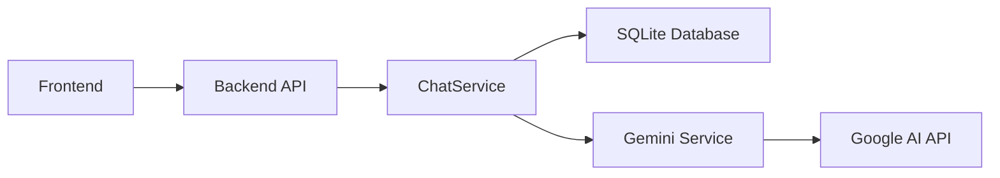

# Documentação Técnica - Gemini ChatBot Web

## 📋 Sumário Executivo

O **Gemini ChatBot Web** é uma aplicação web básica de chatbot inteligente que utiliza o modelo de linguagem Google Gemini através do framework LangChain. A solução é dividida em backend (FastAPI) e frontend (Flask), seguindo princípios de arquitetura em camadas e boas práticas de desenvolvimento.

## 🎯 Objetivo do Projeto

Desenvolver uma solução web para interação com modelos de linguagem natural, proporcionando:
- Interface web moderna e responsiva
- API RESTful robusta
- Persistência de conversas
- Arquitetura escalável e maintainable

## 🏗️ Arquitetura do Sistema

### Diagrama de Arquitetura

```
┌─────────────────┐    HTTP/REST    ┌──────────────────┐
│   Frontend      │◄───────────────►│    Backend       │
│   (Flask)       │                 │   (FastAPI)      │
│                 │                 │                  │
│ • Interface Web │                 │ • API REST       │
│ • Sessões HTTP  │                 │ • Lógica Negócio │
│ • Assets Static │                 │ • Integração AI  │
└─────────────────┘                 └─────────┬────────┘
                                              │
                                      ┌───────▼───────┐
                                      │  Banco de     │
                                      │   Dados       │
                                      │  (SQLite)     │
                                      └───────────────┘
```

### Padrões Arquiteturais Implementados

1. **Client-Server**: Separação clara entre frontend e backend
2. **Layered Architecture**: Divisão em camadas de apresentação, aplicação e dados
3. **RESTful API**: Interface stateless com recursos bem definidos
4. **Dependency Injection**: Injeção de dependências no backend

## 📚 Stack Tecnológica

### Backend
| Componente | Tecnologia | Versão | Propósito |
|------------|------------|---------|-----------|
| **Framework** | FastAPI | ≥0.104.0 | API Web moderna e rápida |
| **ORM** | SQLAlchemy | ≥2.0.0 | Mapeamento objeto-relacional |
| **AI Framework** | LangChain | ≥0.1.0 | Integração com LLMs |
| **LLM** | Google Gemini | gemini-1.5-flash | Modelo de linguagem |
| **Database** | SQLite | 3.x | Persistência local |
| **Validation** | Pydantic | ≥2.0.0 | Validação de dados |
| **Server** | Uvicorn | ≥0.24.0 | ASGI server |

### Frontend
| Componente | Tecnologia | Versão | Propósito |
|------------|------------|---------|-----------|
| **Framework** | Flask | ≥2.3.0 | Aplicação web |
| **HTTP Client** | Requests | ≥2.31.0 | Comunicação com API |
| **Templates** | Jinja2 | (incluído) | Renderização HTML |
| **Styling** | CSS3 | - | Estilização moderna |
| **JavaScript** | ES6+ | - | Interatividade cliente |

### Ferramentas de Desenvolvimento
| Ferramenta | Propósito |
|------------|-----------|
| Python 3.8+ | Linguagem principal |
| pip | Gerenciamento de pacotes |
| venv | Ambientes virtuais |
| dotenv | Variáveis de ambiente |

## 🗂️ Estrutura de Projeto

### Layout de Diretórios
```
gemini-chatbot-web/
├── 🚀 run.sh                    # Script de execução
├── 📖 README.md                 # Documentação
├── 📁 backend/                  # Aplicação FastAPI
│   ├── 📄 main.py              # Entrypoint da aplicação
│   ├── 📋 requirements.txt     # Dependências Python
│   ├── 🔑 .env                 # Variáveis de ambiente
│   ├── 📁 models/              # Modelos de dados
│   │   ├── database.py         # Configuração DB
│   │   ├── chat_models.py      # Modelos SQLAlchemy
│   │   └── schemas.py          # Schemas Pydantic
│   └── 📁 services/            # Lógica de negócio
│       ├── gemini_service.py   # Integração com AI
│       └── chat_service.py     # Serviços de chat
└── 📁 frontend/                # Aplicação Flask
    ├── 📁 app/
         └── app.py              # Aplicação Flask
          ├── 📁 templates/      # Templates HTML
          │   ├── base.html      # Template base
          │   └── index.html     # Página principal
          └── 📁 static/         # Arquivos estáticos
              ├── 📁 css/
              │   └── style.css  # Estilos
              └── 📁 js/
                  └── chat.js    # Lógica cliente

    ├── 📋 requirements.txt     # Dependências
    ├── 🔑 .env                 # Configurações
```

## 🎨 Design e Padrões

### Backend Patterns

#### 1. **Service Layer Pattern**
```python
# Exemplo: ChatService encapsula lógica de negócio
class ChatService:
    def create_session(self, session_data): ...
    def create_message(self, message_data, message_type): ...
    def get_chat_history(self, session_id): ...
```

#### 2. **Repository Pattern**
```python
# Exemplo: Operações de banco abstraídas
def get_session(self, session_id: str) -> ChatSession:
    return self.db.query(ChatSession).filter(ChatSession.session_id == session_id).first()
```

#### 3. **Dependency Injection**
```python
# FastAPI injeta dependências automaticamente
@app.post("/chat")
async def chat_with_ai(
    message_data: MessageCreate,
    db: Session = Depends(get_db)  # DI do banco
):
```

### Frontend Patterns

#### 1. **MVC (Model-View-Controller)**
- **Model**: Estrutura de dados via API
- **View**: Templates Jinja2 + CSS
- **Controller**: Rotas Flask + JavaScript

#### 2. **Component-Based Architecture**
```javascript
// JavaScript modular com classes
class ChatApp {
    constructor() { ... }
    sendMessage() { ... }
    loadHistory() { ... }
}
```

## 🔌 API Specification

### Endpoints Principais

| Método | Endpoint | Descrição | Body | Response |
|--------|----------|-----------|------|----------|
| `GET` | `/` | Status da API | - | `{message, version, status}` |
| `GET` | `/health` | Health check | - | `{api, database, gemini}` |
| `POST` | `/sessions` | Criar sessão | `ChatSessionCreate` | `ChatSessionResponse` |
| `POST` | `/chat` | Enviar mensagem | `MessageCreate` | `ChatResponse` |
| `GET` | `/sessions/{id}/history` | Histórico | - | `ChatHistoryResponse` |
| `GET` | `/sessions` | Listar sessões | - | `{sessions: [...]}` |

### Modelos de Dados

#### ChatSession
```python
class ChatSession(Base):
    id: int (PK)
    session_id: str (Unique)
    created_at: DateTime
    updated_at: DateTime
```

#### ChatMessage
```python
class ChatMessage(Base):
    id: int (PK)
    session_id: str (FK)
    message_type: str  # 'user' ou 'assistant'
    content: Text
    timestamp: DateTime
```

## 🔐 Configuração e Variáveis de Ambiente

### Backend (.env)
```env
# Google Gemini API Key
GOOGLE_API_KEY=sua_chave_aqui

# Database
DATABASE_URL=sqlite:///./chatbot.db

# App Settings
APP_HOST=0.0.0.0
APP_PORT=8000
DEBUG=True
```

### Frontend (.env)
```env
# Backend API
BACKEND_URL=http://localhost:8000

# Flask Settings
FLASK_HOST=0.0.0.0
FLASK_PORT=5000
DEBUG=True
```

## 🚀 Guia de Desenvolvimento

### Pré-requisitos
- Python 3.8+
- pip (gerenciador de pacotes)
- Chave de API Google Gemini

### Setup do Ambiente

```bash
# 1. Configurar variáveis de ambiente
# Editar backend/.env e frontend/.env

# 2. Executar a solução integrada (Backend + Frontend)
./run.sh
```

### Desenvolvimento Local

#### Backend (Terminal 1)
```bash
cd backend
python3 -m venv venv
source venv/bin/activate
pip install -r requirements.txt
python main.py
```

#### Frontend (Terminal 2)
```bash
cd frontend
python3 -m venv venv
source venv/bin/activate
pip install -r requirements.txt
python app/app.py
```

## 🧪 Testes e Qualidade

### Health Checks
- **Backend**: `GET http://localhost:8000/health`
- **Frontend**: `GET http://localhost:5000/health`

### Monitoramento
- **API Docs**: `http://localhost:8000/docs` (Swagger UI)
- **Logs**: Saída console para desenvolvimento

## 🔄 Fluxo de Dados

### Sequência de Chat
1. **Frontend** → Cria sessão via `POST /sessions`
2. **Usuário** → Envia mensagem via `POST /chat`
3. **Backend** → Processa com Gemini Service
4. **Backend** → Persiste mensagens no banco
5. **Backend** → Retorna resposta formatada
6. **Frontend** → Atualiza interface

### Persistência


## 🛠️ Manutenção e Extensibilidade

### Adicionando Novos Recursos

#### 1. Novos Endpoints API
```python
# backend/main.py
@app.post("/new-feature")
async def new_feature(
    data: NewFeatureSchema,
    db: Session = Depends(get_db)
):
    # Implementação
    return {"result": "success"}
```

#### 2. Novos Serviços
```python
# backend/services/new_service.py
class NewService:
    def __init__(self, db: Session):
        self.db = db
    
    def new_method(self, data):
        # Lógica de negócio
        pass
```

#### 3. Novas Páginas Frontend
```html
<!-- frontend/templates/new_page.html -->



<!-- Nova interface -->

```

### Migrações de Banco
```python
# Utilizar Alembic para migrações futuras
alembic revision --autogenerate -m "Description"
alembic upgrade head
```

## 📈 Considerações de Escalabilidade

### Atual
- SQLite para desenvolvimento
- Arquitetura monolítica modular
- Sem cache implementado

### Próximos Passos
1. **PostgreSQL** para produção
2. **Redis** para cache de sessões
3. **Docker** para containerização
4. **Kubernetes** para orquestração
5. **Monitoring** com Prometheus/Grafana

## 🔒 Segurança

### Implementado
- CORS configurado
- Validação de dados com Pydantic
- Sanitização de input no frontend

### Recomendações Futuras
- Autenticação JWT
- Rate limiting
- HTTPS em produção
- Sanitização de output AI

## 📞 Suporte e Troubleshooting

### Problemas Comuns

1. **Erro de Template Não Encontrado**
   - Verificar estrutura de diretórios
   - Templates devem estar em `frontend/templates/`

2. **Erro de Conexão com Backend**
   - Verificar se backend está rodando
   - Confirmar `BACKEND_URL` no .env

3. **Erro de API Key**
   - Validar `GOOGLE_API_KEY` no backend/.env
   - Verificar quotas no Google AI Studio

### Logs e Debug
- Backend: Logs no console com detalhes de erro
- Frontend: Console JavaScript para debug cliente
- Database: Arquivo `chatbot.db` para inspeção

## 📄 Licença e Contribuições

### Licença
[Inserir informação de licença]

### Guidelines para Contribuições
1. Seguir padrões de código estabelecidos
2. Manter cobertura de testes
3. Documentar novas funcionalidades
4. Revisar PRs com time

**Documentação mantida por:** Equipe de Desenvolvimento  
**Última atualização:** Outubro 2025  
**Versão:** 1.0.0
